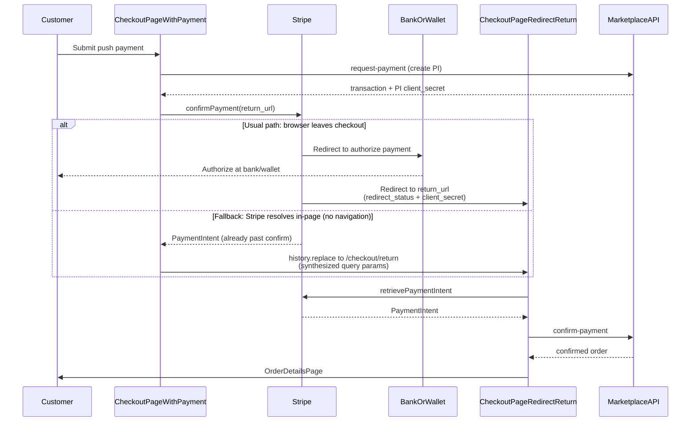

# CheckoutPageRedirectReturn

Client view that finishes checkout after a customer returns from a **Stripe push / redirect**
payment method (for example iDEAL or MobilePay). This is a "proof of concept" / mockup
implementation for testing push payment methods.

It is mounted by [CheckoutPage](../CheckoutPage.js) when the route uses
`extraProps: { mode: 'return-after-redirect' }`
(`[CheckoutRedirectReturnPage](../../../routing/routeConfiguration.js)` →
`/l/:slug/:id/checkout/return`).

## Not in active use by default

**Built-in template processes only expose card (**`paymentDirection: 'pull'`**).** This directory,
the `/checkout/return` route, and the push branch in checkout submit exist so customizers can enable
redirect payment methods without reinventing the return-page UX — but **stock checkout never
navigates here**.

Until you declare push methods on a process and offer them in checkout, treat this as dormant
scaffolding.

## What this component does

1. Hydrates listing + pending transaction from checkout `sessionStorage` (already done by
   CheckoutPage before this view mounts).
2. Reads Stripe return query params (`redirect_status`, `payment_intent_client_secret`).
3. Retrieves the PaymentIntent and checks that customer actions are complete.
4. Runs the Marketplace **confirm-payment** transition (confirm-only — never initiates a new order).
5. On success → OrderDetailsPage. Recoverable failures (`failed` / `canceled` /
   `requires_payment_method`) → back to CheckoutPage to try again. Other confirm failures stay here
   with a retry control.

Related code:

- [CheckoutPageRedirectReturn.js](./CheckoutPageRedirectReturn.js) — UI + resume effect
- [CheckoutPageRedirectReturn.helpers.js](./CheckoutPageRedirectReturn.helpers.js) — retrieve +
  confirm sequence
- Push submit path: [CheckoutPageWithPayment.js](../CheckoutPageWithPayment.js) +
  `processCheckoutWithPayment` in
  [CheckoutPageTransactionHelpers.js](../CheckoutPageTransactionHelpers.js)

## Flow



Card checkout does **not** use this view: request → Stripe card confirm → Marketplace confirm all
run in one submit chain on CheckoutPage.

## Enabling Stripe push payment methods

Follow the checklist in [transactions/README.md](../../../transactions/README.md) (pull vs push,
process module contract). In short:

### 1. Backend transaction process

- Use Sharetribe actions appropriate for push (e.g. `:action/stripe-create-payment-intent-push`).
- Provide request-payment / confirm-payment transitions the client can resolve via
  `getCheckoutPaymentTransitions`.
- Capture / accept graph: many push methods do not support manual capture — you may need
  accept-without-capture or purchase-style capture-on-confirm.

### 2. Client process + payment catalog

- Declare the method under `supportedPayments.stripe` with `paymentDirection: 'push'`.
- Add or extend the method in [paymentMethods.js](../../../transactions/paymentMethods.js) (currency
  allowlist, `supportsSavePaymentMethod: false`).
- Wire privileged transitions in `isPrivileged` when required.
- Add StripePaymentForm copy (`StripePaymentForm.paymentMethod.{id}`).

### 3. Server-side validation

Privileged initiate/transition endpoints sanitize `paymentMethodTypes` through
[pushPaymentMethodValidation.js](../../../../server/api-util/pushPaymentMethodValidation.js). Add
the Stripe type string to `STRIPE_PUSH_PAYMENT_METHOD_TYPES` and keep it aligned with what checkout
offers and what Stripe / Sharetribe allow for push.

### 4. Stripe webhooks / reconciliation (required for a real marketplace)

The browser return path is only a **first / partial** completion step: it finishes Marketplace
confirm when the customer comes back to `/checkout/return`. If they authorize at the bank or wallet
but never return, the process’s delayed **expire-payment** transition (e.g. after 15 minutes) moves
the transaction to `payment-expired` and runs `stripe-refund-payment` — so a successful Stripe
payment may be refunded instead of confirmed (and Stripe processing fees are typically not returned
on that refund). Use webhooks (or equivalent reconciliation) to confirm or fail promptly without
depending on the browser return.

Plan for:

- Listening to relevant Stripe PaymentIntent events (e.g. `succeeded`, `processing`,
  `payment_failed` / canceled equivalents).
- A trusted server path that runs confirm-payment or fail transitions without the return page
  (Sharetribe Integration API / custom endpoint — not shipped in this template).
- Idempotency: confirm may run from the return page **and** from a webhook; transitions should
  tolerate “already confirmed.”

Without webhooks (or equivalent polling), push checkout is incomplete for production.

### 5. Ops / product notes

- Push methods are usually currency- and country-specific (e.g. iDEAL → EUR).
- Saved cards do not apply; hide save-card UX for push.
- Provider UI that chooses accept vs accept-without-capture should read
  `protectedData.checkoutPaymentMethod` when multiple methods exist.
- Account deletion / Stripe customer cleanup may need updates for new payment states
  (`server/api/delete-account.js`).

### 6. Translations for this return page

These strings are **not** in the template’s `en.json` (or other locale files). Add them to
**hosted translations** in Console (preferred), and/or to your local
`src/translations/en.json` fallbacks:

```json
"CheckoutPage.redirectReturn.title": "Confirming payment",
"CheckoutPage.redirectReturn.resumeFailed": "We couldn't finish confirming your payment. Please try again.",
"CheckoutPage.redirectReturn.retry": "Try again"
```

Without these keys, the return page UI shows missing-message placeholders.

## Other notes for customizers

- **Route vs mode** — Path stays `/l/:slug/:id/checkout/return`. Route `name` is
  `CheckoutRedirectReturnPage`; component is still `CheckoutPage` with
  `mode: 'return-after-redirect'`. Stripe `return_url` is built via `pathByRouteName` in
  CheckoutPageWithPayment.
- **Session storage** — Resume needs the CheckoutPage session payload (listing + transaction). If it
  is missing (cleared storage, other browser), the customer cannot finish on this page.
- **Query params** — Stripe puts `payment_intent_client_secret` on the return URL. This page sets
  `referrer="no-referrer"` on `Page` to reduce Referer leakage. The URL is still visible in history
  until you add further hardening (e.g. strip search after reading params).
- **Do not log** `location.search` or client secrets when debugging.
- **Security model** — URL `redirect_status` is only used for early UX (e.g. bounce back on
  canceled). Client-side retrieve gates the UI, but Marketplace confirm (Sharetribe process actions
  on the transaction’s PaymentIntent) is what actually completes the order — do not treat query
  params as proof of payment by themselves.
- **Testing** — Unit tests live in
  [CheckoutPageRedirectReturn.test.js](./CheckoutPageRedirectReturn.test.js). End-to-end push flows
  need a process that actually offers a push method plus Stripe test mode.

See also:

- [CheckoutPage README](../README.md) — overall checkout call sequence
- [transactions README](../../../transactions/README.md) — payment methods and process hooks
- [Sharetribe: stripe-create-payment-intent-push](https://www.sharetribe.com/docs/references/transaction-process-actions/#actionstripe-create-payment-intent-push)
